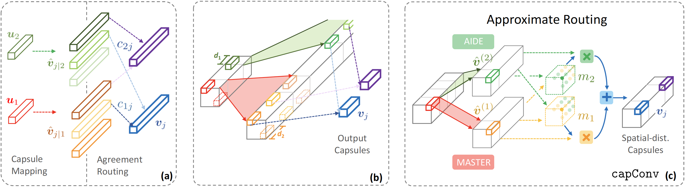

# Capsule Research

The official implementation of the paper [Neural Network Encapsulation](http://www.ee.cuhk.edu.hk/~yangli/paper/eccv18_capsule.pdf), published in ECCV 2018.



## Lightening Sum-up: a **Research** side

- Analyze the two routing schemes (Dynamic and EM) in original capsule papers.

- Propose an approximation routing workaround to tackle the computational inefficiency, in a supervised manner.
Network elements are still in form of capsules (vector other than scalar).

- That is why we call the network is **encapsulated**.

- Adopt the optimal transport algorithm to make higher and lower capsules align better.


## Lightening Sum-up: an **Implementation** side

- PyTorch `0.3.x` or `0.4`

- Provide our own implementation of the original papers, namely dynamic and EM routing.


- Use [visdom](https://github.com/facebookresearch/visdom) to visualize training dynamics. You can disable it for sure.

- Datasets: MNIST, CIFAR-10/100, SVHN and a subset of ImageNet.

- Support multi-gpu (nothing to brag about; still we wanna emphasize here for no reason)


## Grab and Go

TODO.

## File Structure

TODO.


## Rome-built-in-multi-days

- [x] Code release for orginal capsule papers

- [ ] Support PyTorch `0.4`

- [ ] h-ImageNet dataset and result


## Citation
```
@inproceedings{li2018encapsulation,
  author = {Hongyang Li and Xiaoyang Guo and Bo Dai and Wanli Ouyang and Xiaogang Wang},
  title = {Neural Network Encapsulation},
  booktitle = {ECCV},
  year = {2018}
}
```